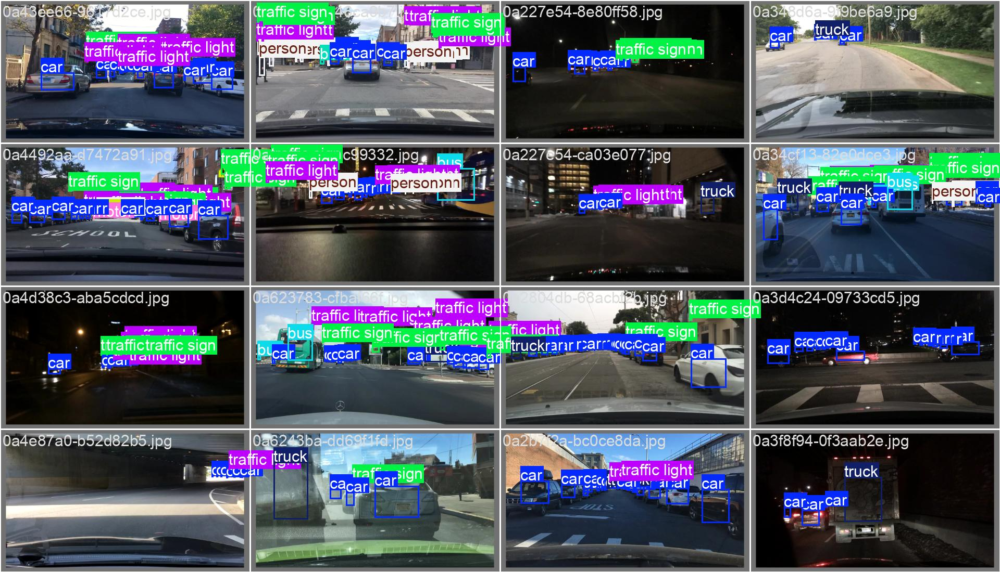

YOLOv8 Training on BDD100K Subset

Project Overview:
This project trains a YOLOv8 model using a small subset of the BDD100K dataset, a diverse driving dataset for autonomous driving tasks.

Dataset: BDD100K (subset)

Classes: Various road objects (cars, pedestrians, traffic signs, etc.)

Data Format: Images and corresponding annotations (originally in json but then converted to .txt to make it yolo compatible)

Params:
    imgsz=640
    epochs=10
    batch=32

